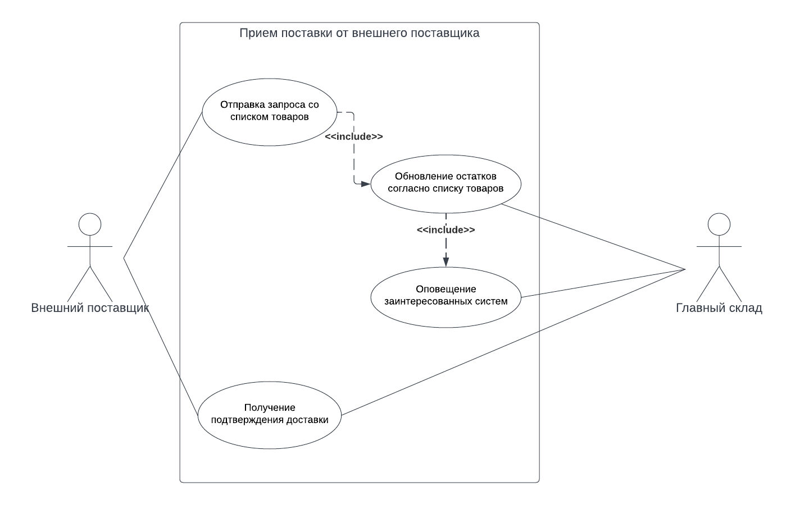

# Прием поставки от внешнего поставщика

[Назад](README.md) | [На главную](../../../README.md)

## Описание 

|  |  |
| --- | --- |
| Акторы | Главный склад, Система внешнего поставщика |
| Цель | Прогрузить товары в системы интернет магазина |
| Триггер | Система внешнего поставщика обратилась в систему центральнго склада
| Результат | Остатки товаров обновлены согласно поставленным товарам
| | Заинтересованные системы оповещены об обновлении остатков товаров
| | Поставщик получил подтверждение, что товар получен

## Действия

| № шага | Актор | Шаг |
| --- | --- | --- |
| 1 | Система внешнего поставщика | Отправляет запрос в систему главного склада с информацией о доставленных товарах
| 2 | Главный склад | Обновляет остатки товаров в своей базе данных
| 3 | Главный склад | Оповещает все заинтересованные системы об обновлении остатков
| 4 | Главный склад | Оповещает систему внешнего поставщика, что товар успешно получен

