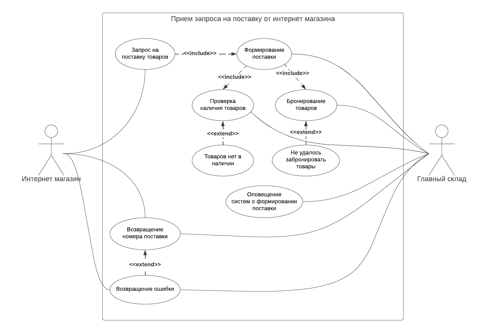

# Прием запроса на поставку от интернет магазина

[Назад](README.md) | [На главную](../../../README.md)

## Описание 

|  |  |
| --- | --- |
| Акторы | Интернет магазин, Главный склад |
| Цель | Сформировать поставку заказа в розничный магазин |
| Триггер | Интернет магазин отправил запрос на формирование поставки
| Результат | Новая поставка сформирована и взята в работу сотрудниками склада
| | Заинтересованные системы оповещены о формировании новой поставки
| | Интернет магазин получил номер сформированной поставки

## Действия

| № шага | Актор | Шаг |
| --- | --- | --- |
| 1 | Интернет магазин | Отправляет запрос в систему главного склада для формирования поставки указанных в запросе товаров
| 2 | Главный склад | Проверяет наличие товаров
| 3 | Главный склад | Бронирует товары для поставки
| 4 | Главный склад | Формирует новую поставку
| 5 | Главный склад | Оповещает заинтересованные системы о формировании поставки
| 6 | Главный склад | Возвращает интернет магазину номер сформированной поставки
| Альтернативные сценарии |
| 1 | Необходимых товаров нет в наличии | Главный склад отвечает на запрос ошибкой
| 2 | Не удалось забронировать товары для поставки | Главный склад отвечает на запрос ошибкой

